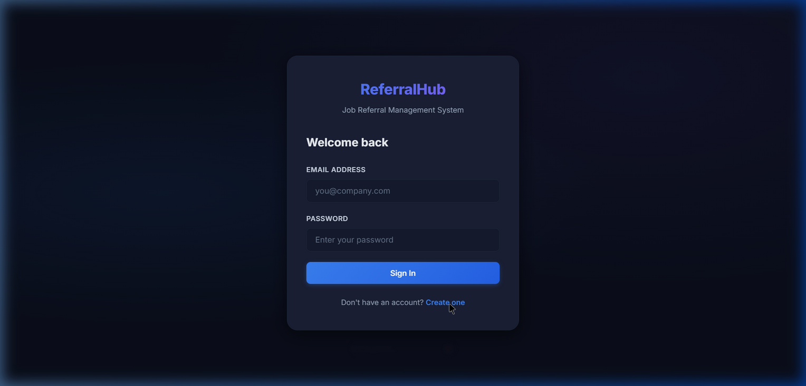
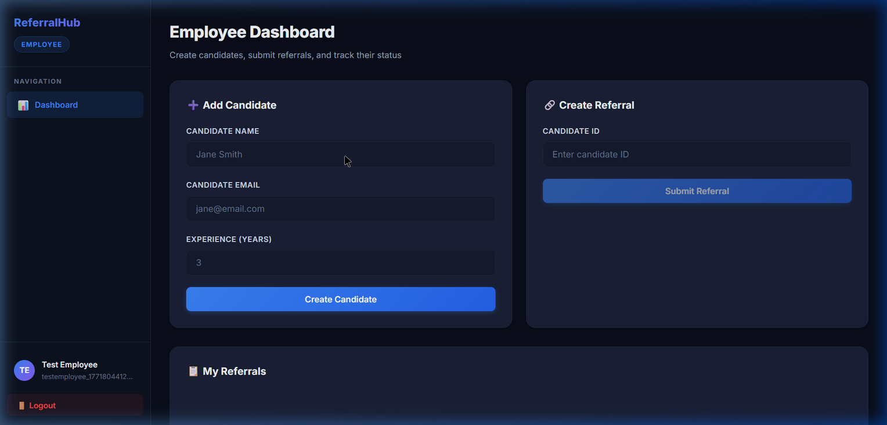
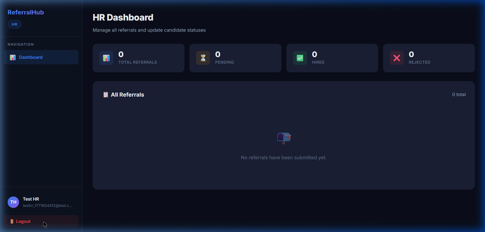

# 🔗 ReferralHub: Job Referral Management System

A modern, production-ready React frontend for managing employee referrals. Built with React, Apollo Client, and a live GraphQL backend.


---

## ✨ Features

- **JWT Authentication** — Login & Register with token stored in localStorage
- **Role-Based Dashboards** — Separate views for Employees and HR Managers
- **Employee Dashboard** — Create candidates, submit referrals, track status
- **HR Dashboard** — View all referrals, update status (Pending / Hired / Rejected)
- **Protected Routes** — Unauthorized users are redirected to login
- **Real-time GraphQL** — Connected to a live backend (no mocked data)
- **Responsive Design** — Clean dark-themed UI that works on all screen sizes
- **Vercel-Ready** — Pre-configured for instant deployment

---

## 🛠️ Tech Stack

| Layer         | Technology                          |
|---------------|-------------------------------------|
| Framework     | React 19                            |
| Build Tool    | Vite 7                              |
| GraphQL       | Apollo Client 4                     |
| Routing       | React Router DOM 7                  |
| Auth          | JWT (jwt-decode)                    |
| Styling       | Vanilla CSS (custom design system)  |
| Deployment    | Vercel                              |

---

## 📸 Screenshots

### Login Page
<p align="center">
  
</p>

### Employee Dashboard
<p align="center">
  
</p>

### HR Dashboard
<p align="center">
  
</p>

---

## 🚀 Getting Started

### Prerequisites

- [Node.js](https://nodejs.org/) v18+
- npm or yarn

### Installation

```bash
# Clone the repository
git clone https://github.com/your-username/referralhub.git
cd referralhub

# Install dependencies
npm install

# Start development server
npm run dev
```

The app will be running at **http://localhost:5173**

### Production Build

```bash
npm run build
npm run preview
```

---

## 🔌 Backend API

The app connects to a live GraphQL backend:

```
https://job-referral-backend.onrender.com
```

### GraphQL Schema

**Queries:**
| Query | Description |
|-------|-------------|
| `me` | Get current authenticated user |
| `myReferrals` | Get referrals created by the current user |
| `allReferrals` | Get all referrals (HR only) |

**Mutations:**
| Mutation | Description |
|----------|-------------|
| `login(email, password)` | Authenticate and receive JWT |
| `register(name, email, password, role)` | Create a new account |
| `createCandidate(name, email, experienceYears)` | Add a candidate |
| `createReferral(candidateId)` | Submit a referral |
| `updateReferralStatus(referralId, status)` | Update referral status (HR) |

**Enums:**
- `Role`: `EMPLOYEE` · `HR`
- `ReferralStatus`: `PENDING` · `HIRED` · `REJECTED`

---

## 📁 Project Structure

```
src/
├── apollo.js                  # Apollo Client with JWT auth header
├── App.jsx                    # Router & app shell
├── main.jsx                   # Entry point
├── index.css                  # Global design system
├── context/
│   └── AuthContext.jsx        # Auth state management
├── graphql/
│   ├── queries.js             # GraphQL queries
│   └── mutations.js           # GraphQL mutations
├── components/
│   ├── Layout.jsx             # Sidebar layout with navigation
│   └── ProtectedRoute.jsx     # Route guard (auth + role)
└── pages/
    ├── LoginPage.jsx          # Login form
    ├── RegisterPage.jsx       # Registration form
    ├── EmployeeDashboard.jsx  # Employee view
    └── HRDashboard.jsx        # HR view
```

---

## 📝 License

This project is licensed under the MIT License.
